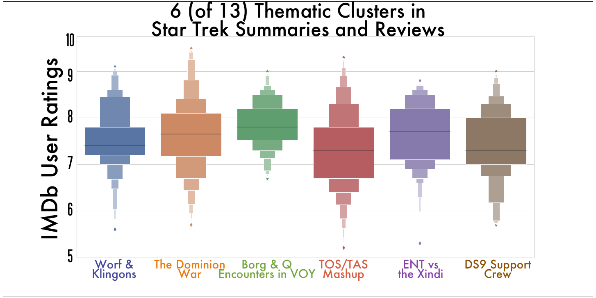

### Introduction:

Ever wanted to jump into the conversation at work about the latest *Law & Order*? Or met someone new that you that you really like and think could be _the one_...and they also just so happen to be really into *The Simpsons*?

If you’ve got a few hours, Warp10 has you covered: it’s a hybrid recommender designed to suggest a thematically diverse and representative sampling of a given TV series in a user-defined number of episodes. For this project, I used _Star Trek_ as my test case, given its fairly intimidating 719 episode run from _The Original Series_ to _Enterprise_.

### So, what does it do? (And how?)

Unlike typical recommenders, which return suggestions based on a user’s consumption and rating patterns or their similarity to other users, Warp10 champions variety, giving users the breadth and depth of an episodic series, and in turn, more conversational topics to deploy at work tomorrow or on that next date.

Designed in Python, Warp10 utilizes SKLearn and Surprise’s k-Means clustering and NMF algorithms to create “topic clusters” from IMDb user reviews, ratings, and episode summaries in two distinct ways:

**1.	_Clustering episodes based on the most common terms in IMDb user review and episode summary text._**

>First, I tokenized and vectorized my text data with SKLearn's TFIDF vectorizer, giving me the frequency and weight of common and less common words and where they occurred relative to the episodes they were about prior to clustering them.
>
>To determine the optimal number of clusters, I ran k-Means on my vectorized text data multiple times, each time increasing the number of clusters it would create so that I could evaluate each clustering by Silhouette score. The model with the best number of clusters would, in theory, yield the highest score.

>Interestingly, the highest score occurred at five clusters. This makes sense, given that there are essentially five distinct crews between the six series of _Star Trek_ (as k-Means was lumping together _Star Trek: The Original Series_ and *Star Trek: The Animated Series*, two series that share largely the same cast).
>
>Although it was encouraging that k-Means picked up on these natural distinctions between the series (and thus showing that, as proof of concept, it can indeed create intuitive and sensible clusters), having it tell us that there are five/six different _Star Trek_ series wasn't particularly helpful. Pushing k-Means to another high scoring model at 13 clusters seemed to do the trick since it allowed major themes and storylines between the different _Star Trek_ series to emerge. (Pushing it to generate even more clusters, despite comparably high scores to 13 increased the risk of creating clusters of singular episodes, which would be undesirable should we seek to produce new recommendations from our clusters.)

>Given that I wanted themes, the interesting lesson in this exercise was that optimizing my model to a particular metric would _not_ yield the best results. Creating models that minimize or maximize a given metric had, until this point, always seemed the best way to build them, but that notion was quickly challenged by my goal of seeking variety. Using a bit of human judgment in addition to a high (but not the highest!) Silhouette score thus proved to be the best path forward in giving me what I wanted: multiple _thematic_ clusters with collections of episodes to recommend from.

**2.	_Using matrix factorization to tease out latent features or “hidden themes” via IMDb user ratings._**

>Intuiting the themes of k-Means's clusters was simple enough, if slightly time-consuming. All I (and some of my very helpful friends) had to do was to look at the highest occurring unique terms in each cluster to get an idea of the subjects that were most represented in them.
>
>Using Non-Negative Matrix Factorization yielded less easily interpretable results however.
>
>Matrix factorization algorithms like NMF and SVD are typically employed to determine what users will rate media or items they haven't consumed before, typically via data on what users have seen or rated previously and/or their similarity to other users' ratings and consumption patterns. Ideally, a low root mean squared error and/or mean absolute error, as evaluation metrics, would imply that the predicted ratings from our matrix factorization algorithm is pretty close to what users will eventually end up rating an item. This would thus allow an algorithm to recommend items that it predicts a user would rate highly. By extension, this gives us some confidence in our algorithm essentially "knowing" its users and their affinity for some set of media/items.
>
>I didn't use NMF this way however, instead opting to have it determine "hidden themes" or latent features as byproducts of the factorization of a user-episode ratings matrix and using those as recommendations instead. Like we faced with k-Means however, I had to address what the best number of latent features for our model. In a bit of a reversal of my approach with k-Means, this is where using error metrics like RMSE and MAE came into play under the assumption that, should the scores be decent, there's some confidence that the algorithm "knows" its users and subjects well and that the latent features it calculates are true to the series.
>
>Narrowing the number of latent features to twenty (by way of extensive grid searching to minimize RMSE and MAE), I then sought episodes that had the strongest scores for each latent feature. Though less interpretable than k-Means's text clusters, NMF thus provided twenty episodes thematically (and magically, mathematically) different from one another.
>
>With both algorithms splitting the totality of _Star Trek_ in their unique ways, all that remains is delivering episode recommendations from either method given the user's desired number of episodes. At the moment, it selects from both recommendations randomly, though this will likely be changed in future iterations.

### Post-Mortem:

Given _Star Trek’s_ largely episodic format, it’s easy to recommend episodes as most require very little context before viewing. This won’t work for television shows like _Game of Thrones_ or _Breaking Bad_ however, making serialized television Warp10’s biggest (and possibly insurmountable?) challenge.

In generating clusters, there's also the not insignificant chance of creating clusters with a single episode. This makes successive recommendations from such clusters redundant and otherwise useless (e.g., "whenever I ask for new recommendations, I always get one for 'Little Green Men'"). Similarly, thematic clusters have the potential to change, both subtly and significantly, depending on the random state in which k-Means splits its clusters. While there is a valid argument for creating a model that's both good at what it was designed to do _and_ consistent, this tendency of k-Means does appear to bother some. It remains to be seen, however, whether this really will be detrimental to Warp10's recommendations. I simply need to test its recommendations on more users to find out, and refine as necessary with different parameters or different algorithms (more on that below).

Returning to the topic of metrics, there was also the issue of judging Warp10’s recommendations as there seemed to be no perfect metric to assess recommendation variety and quality outside of human judgment. With the subjective nature of human taste however, tuning Warp10 to suit most people (let alone Trekkies) hasn't been a trivial task and will require further testing and perfecting. By way of example, two of my testers argued for different sets of hyperparameters early on in Warp10's development based on what they deemed produced stronger recommendations for first-time viewers. Judging which lineups--and thus, hyperparameters--were better in such a fashion is a lot more complicated than just running a gridsearch and minimizing for a particular error metric. Nonetheless, this approach will likely remain integral to how Warp10 evolves given that its truest utility is in offering up diverse recommendations that appeal to its users' tastes. Judging its performance at recommending variety is thus not an insignificant endeavor; we live in the very strange and often alienating age of algorithmic sorting of human tastes into monocultural niches. Recent history has shown that this can be problematic. In its own humble way, Warp10 humbly aims to be a response that will hopefully over time offer an alternative to typical recommendation algorithms.

Lastly, interpretability remains an issue, both with some of Warp10’s text clusters and especially with the latent features it derives from matrix factorization. Like appraisal of its recommendations, Warp10 requires a fair bit of human judgment in determining what themes are singled out in its clusters, and yet more careful parsing in its otherwise inscrutable latent features. Owing to time constraints, my friends and I were unfortunately unable to determine the particular themes NMF had computed from the user-rating matrix, though it's something that I hope in time we'll get to, no matter how challenging an endeavor it might end up being.

### Future work:

Warp10 currently uses only two algorithms to split up a given TV series. I’m hoping to experiment with and include more in the future given that different algorithms cluster episodes or derive latent features differently. Warp10 also needs to be generalized to be series agnostic so that it can be used with other television shows (such as Law & Order, the Simpsons, South Park, etc.) prior to it being released online. It’s my hope that once it’s out in the open, users can help direct Warp10’s development, both in the algorithms it employs and the tuning of its many parameters.
